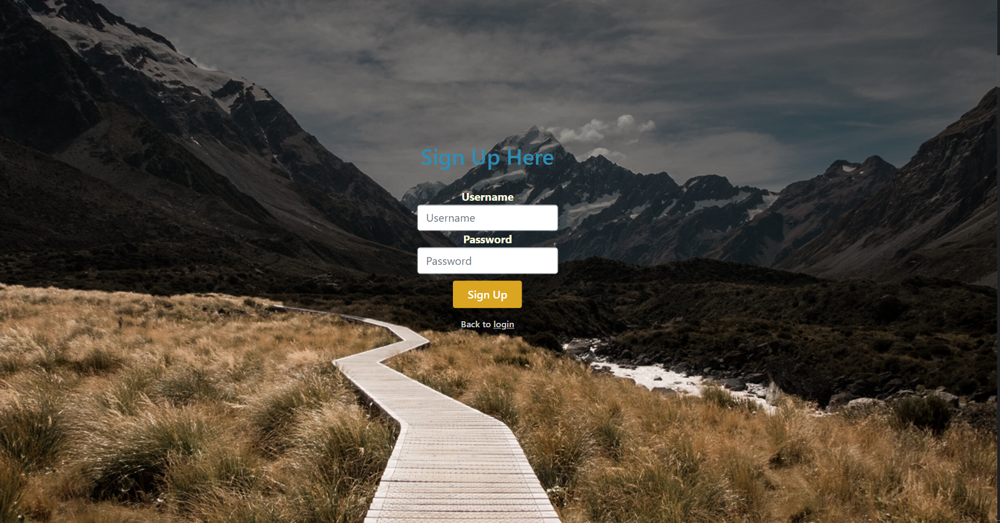
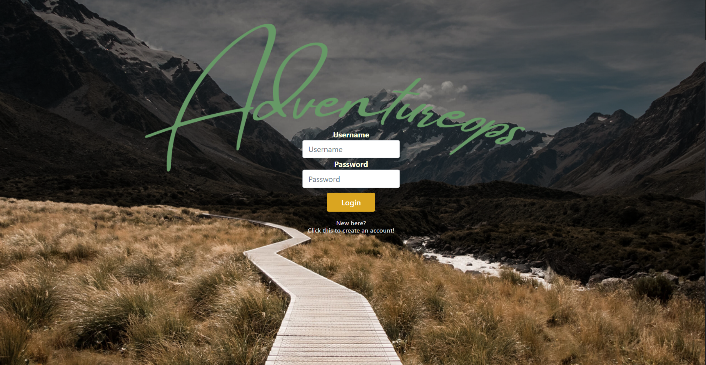
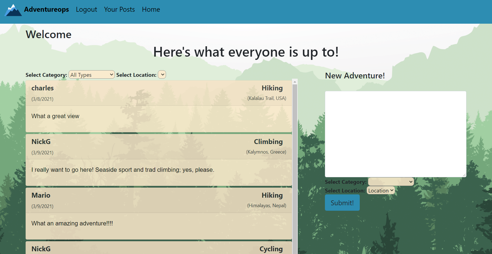
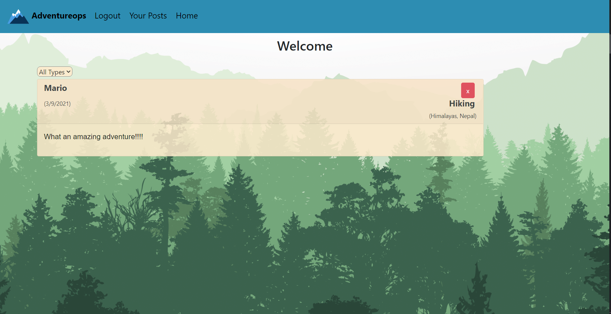

# Project2

## Adventureops 

## Table of Contents 

[Description](#description)

[Installation](#installation)

[Tech Used](#tech_used)

[Future Development](#future_development)

[Screenshots](#screenshots)

[Collaborators](#collaborators)

[Link to deployed app](#link)

[Questions](#questions)

## Description 

If you are an outdoor enthusiast and love to talk all about your outdoor adventures, then Adventureops is for you. With Adventureops, the user can create an username and password to be stored into our database to be used for future logins. Once the login information is created the user is presented with a homepage that has a feed section and a section to create post. The user can speak their mind about the outdoor activity of their choice and assign that post to the specific activity and location on where it happened. The user can also organize their feed to only display all the post of a specific outdoor activity that they and other users created. The user can also select on "Your Post" to view post they created and also organize it by a specific outdoor activity. 

## Installation 

To install the necessary dependencies, run the following command:

----------
npm i
----------

## Tech Used

* Sequelize
* MySql2
* Express
* Express-Handlebars
* Passport 
* Bcryptjs
* Talkjs

## Future Developments

Some of the future developments we hope to add to Adventureops are: 

* Allow users to create locations they want to post about 

* Have pictures for locations included and allow user to upload pictures of the location they are posting about

* Allow users to input a difficulty level to each location they post about.

* Add a chat functionality to allow different users to communicate among each other.  

## Screenshots

## Collaborators

* Charles Zoeller - [GitHub Page](https://github.com/czoeller1)

* Nick Goedecke - [GitHub Page](https://github.com/Perkyderm)

* David Tran - [GitHub Page](https://github.com/DavidTran303)

* Mario Lavina - [GitHub Page](https://github.com/Lavina91)

## Link 
[Link to deployed Heroku app](https://adventureops.herokuapp.com/login)

## Questions 

If you have any questions about the repo, open an issue or contact me directly at mlavina91@gmail.com. 

